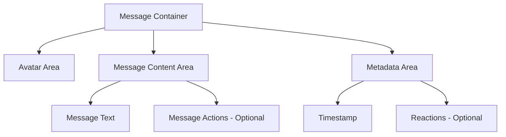

# Enhanced Chat Message Design for Sybot AI

## Current State Analysis

Based on the code review, the current chat message implementation in `components/collapsible-message.tsx` has:

- Basic bubble styling with minimal visual distinction
- Simple timestamp display
- Basic user vs assistant differentiation
- Limited interactive elements
- No animations or micro-interactions

## Enhanced Design Goals

1. Create visually distinct message bubbles for user and assistant
2. Implement modern styling with appropriate shadows and borders
3. Add better metadata display (timestamps, reactions)
4. Include subtle animations for message entrance
5. Enhance accessibility and readability
6. Add interactive elements for message actions

## Detailed Design Specification

### Visual Design

#### User Messages

- Background: Subtle primary color with low opacity (primary/10 in light mode, primary/20 in dark mode)
- Border: Light border using primary/20
- Text: Primary foreground color
- Alignment: Right-aligned
- Border radius: 16px with sharper corner on the right bottom
- Shadow: Subtle shadow for depth

#### Assistant Messages

- Background: Clean white/soft dark background (white/80 in light mode, card/90 in dark mode)
- Border: Light border using border/50
- Text: Standard foreground color
- Alignment: Left-aligned
- Border radius: 16px with sharper corner on the left bottom
- Shadow: Subtle shadow for depth

#### Message Container Structure



### Enhanced Styling Implementation

#### CSS Classes for Message Bubbles

```css
/* Enhanced message bubble styling */
.message-bubble {
  @apply relative flex flex-col px-5 py-4 transition-all duration-200;
  max-width: 85%;
  box-shadow: 0 2px 6px -1px rgba(0, 0, 0, 0.05), 0 1px 4px -1px rgba(0, 0, 0, 0.05);
  border: 1px solid;
}

.message-bubble-user {
  @apply bg-primary/10 dark:bg-primary/20 border-primary/20 rounded-3xl;
  border-bottom-right-radius: 4px;
}

.message-bubble-assistant {
  @apply bg-white/80 dark:bg-card/90 border-border/50 rounded-3xl;
  border-bottom-left-radius: 4px;
}

/* Enhanced content area */
.message-content {
  @apply py-2 flex-1;
}

/* Enhanced metadata styling */
.message-metadata {
  @apply flex items-center justify-between mt-2 text-xs;
}

.timestamp {
  @apply text-muted-foreground/70;
}

.reactions {
  @apply ml-2 flex space-x-1;
}

.reaction-button {
  @apply rounded-full p-1 hover:bg-muted transition-colors;
}
```

### Animation Implementation

#### Entrance Animations

```css
/* Message entrance animations */
@keyframes fadeInUp {
  from {
    opacity: 0;
    transform: translateY(10px);
  }
  to {
    opacity: 1;
    transform: translateY(0);
  }
}

.animate-fade-in-up {
  animation: fadeInUp 0.3s ease-out forwards;
}

/* Staggered animation for conversation flow */
.message-animation-delay-1 {
  animation-delay: 0.05s;
}
.message-animation-delay-2 {
  animation-delay: 0.1s;
}
.message-animation-delay-3 {
  animation-delay: 0.15s;
}
```

### Component Structure Enhancement

#### Updated CollapsibleMessage Component

```tsx
// Enhanced CollapsibleMessage component structure
export function CollapsibleMessage({
  children,
  role,
  isCollapsible = false,
  isOpen = true,
  header,
  onOpenChange,
  showBorder = true,
  showIcon = true
}: CollapsibleMessageProps) {
  // Add timestamp generation
  const now = new Date()
  const timestamp = now.toLocaleTimeString([], {
    hour: '2-digit',
    minute: '2-digit'
  })

  // Animation delay for conversation flow
  const animationDelay = Math.min(0.2, Math.random() * 0.15)

  return (
    <div
      className={cn(
        'flex w-full items-end gap-2 animate-fade-in-up',
        role === 'user' ? 'justify-end' : 'justify-start'
      )}
      style={{ animationDelay: `${animationDelay}s` }}
    >
      {/* Avatar area for assistant messages */}
      {role === 'assistant' && showIcon && (
        <div className="flex flex-col items-center mr-2">
          <div className="w-8 h-8 flex items-center justify-center rounded-full bg-white/90 dark:bg-card/90 shadow-sm border border-border/50">
            <IconLogo className="size-5" />
          </div>
        </div>
      )}

      {/* Message content area */}
      <div
        className={cn(
          'message-bubble',
          role === 'assistant'
            ? 'message-bubble-assistant'
            : 'message-bubble-user'
        )}
        tabIndex={0}
        aria-label={role === 'user' ? 'User message' : 'Assistant message'}
      >
        {header && <div className="mb-2">{header}</div>}
        <div className="message-content">{children}</div>

        {/* Enhanced metadata area */}
        <div className="message-metadata">
          <span className="timestamp">{timestamp}</span>
          <div className="reactions">
            <button className="reaction-button" aria-label="Like message">
              👍
            </button>
            <button className="reaction-button" aria-label="Dislike message">
              👎
            </button>
            <button className="reaction-button" aria-label="Copy message">
              📋
            </button>
          </div>
        </div>
      </div>

      {/* Avatar area for user messages */}
      {role === 'user' && showIcon && (
        <div className="flex flex-col items-center ml-2">
          <div className="w-8 h-8 flex items-center justify-center rounded-full bg-primary/10 dark:bg-primary/20 shadow-sm border border-primary/20">
            <UserCircle2
              size={20}
              className="text-primary/70 dark:text-primary/80"
            />
          </div>
        </div>
      )}
    </div>
  )
}
```

### Accessibility Improvements

1. **Semantic HTML Structure**:

   - Proper use of aria-labels for message types
   - Keyboard navigable elements
   - Sufficient color contrast ratios

2. **Screen Reader Support**:

   - Timestamp announcements
   - Reaction button labels
   - Message content identification

3. **Focus Management**:
   - Clear focus indicators
   - Logical tab order
   - Skip navigation options

### Responsive Design Considerations

#### Mobile Optimizations

- Increased touch target sizes for reactions
- Reduced horizontal padding on small screens
- Simplified metadata display on mobile
- Better message bubble sizing for narrow screens

#### Desktop Enhancements

- Wider message bubbles
- More detailed metadata
- Additional reaction options
- Enhanced hover states

### Performance Considerations

1. **Animation Optimization**:

   - Use CSS transforms instead of layout changes
   - Limit animation complexity
   - Use `will-change` property appropriately

2. **Rendering Efficiency**:
   - Virtualized message list for long conversations
   - Memoization of message components
   - Efficient re-rendering strategies

### Implementation Roadmap

#### Phase 1: Basic Styling Enhancement

1. Update CSS classes for message bubbles
2. Implement new color scheme
3. Add border radius improvements
4. Enhance shadow effects

#### Phase 2: Animation Integration

1. Add entrance animations
2. Implement staggered conversation flow
3. Add hover effects
4. Enhance transition states

#### Phase 3: Interactive Elements

1. Add reaction buttons
2. Implement message actions
3. Add copy functionality
4. Include timestamp enhancements

#### Phase 4: Responsive Optimization

1. Mobile-specific styling
2. Touch target improvements
3. Adaptive layout changes
4. Performance tuning

## Comparison with Leading AI Interfaces

### Improvements Over Current Design

1. **Visual Hierarchy**: Clearer distinction between user and assistant messages
2. **Professional Appearance**: More polished and modern styling
3. **Interactive Elements**: Enhanced user engagement options
4. **Accessibility**: Better support for all users
5. **Performance**: Optimized animations and rendering

### Competitive Advantages

1. **Custom Branding**: Distinctive visual identity with Sybot branding
2. **Enhanced Metadata**: Better timestamp and reaction display
3. **Smooth Animations**: Polished entrance and interaction animations
4. **Responsive Design**: Optimized for all device sizes
5. **Accessibility**: WCAG compliant design

## Technical Implementation Details

### File Modifications Required

1. **components/collapsible-message.tsx**:

   - Complete restructuring of component
   - Enhanced styling implementation
   - Animation integration
   - Accessibility improvements

2. **app/globals.css**:

   - New CSS variables for message styling
   - Animation keyframes
   - Responsive breakpoints

3. **components/ui/icons.tsx**:
   - Potential enhancements to avatar icons

### Dependencies and Considerations

1. **Existing Dependencies**:
   - Continue using Tailwind CSS for styling
   - Maintain
