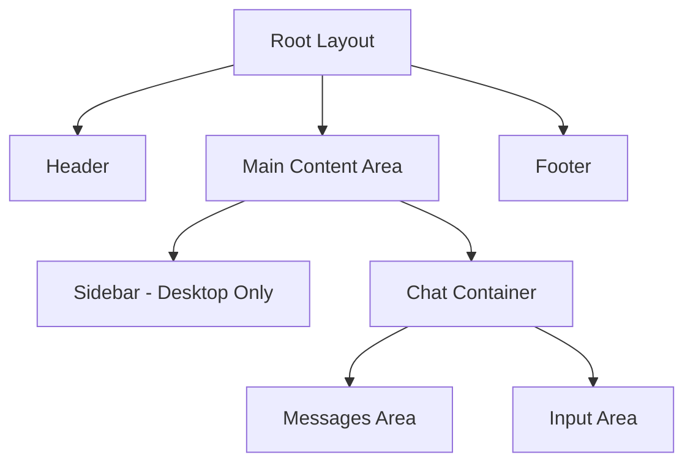

# UI Improvement Plan for Sybot AI

## Current UI Analysis

Based on the code review, the current UI has:

- A responsive layout with a sidebar hidden on mobile
- Fixed header with logo and navigation controls
- Chat messages displayed in a simple column layout
- Fixed input area at the bottom
- Tool sections for search, video search, and retrieve operations
- Search results displayed in a grid layout

## Key Areas for Improvement

1. Layout and spacing
2. Visual hierarchy
3. Component design
4. Responsive behavior
5. Color scheme and typography
6. Interactive elements

## Detailed Improvement Plan

### 1. Layout and Spacing Improvements

#### Current Issues:

- Limited spacing between elements
- Fixed-width container may feel constrained
- Mobile layout could be more optimized
- Chat bubbles lack visual distinction

#### Proposed Solutions:

**Main Layout Structure:**

**Enhanced Spacing System:**

- Implement a consistent spacing scale (4px, 8px, 12px, 16px, 24px, 32px, 48px)
- Add proper padding around the chat container
- Improve vertical rhythm between messages
- Better separation between tool sections

**Improved Container Design:**

- Wider max-width for better content display (1200px instead of current)
- Better padding on sides (24px on desktop, 16px on mobile)
- More breathing room around input area
- Enhanced sidebar design with better organization

### 2. Visual Hierarchy Improvements

#### Current Issues:

- Similar styling for all message types
- Limited visual distinction between user and assistant messages
- Tool sections lack clear visual hierarchy
- Insufficient contrast between elements

#### Proposed Solutions:

**Enhanced Message Components:**

- Different background colors for user vs assistant messages
- Improved visual styling for chat bubbles with subtle shadows
- Better typography hierarchy (headings, body text, captions)
- Clearer visual distinction for tool sections
- Enhanced timestamp and metadata display

**Improved Tool Section Design:**

- Better visual grouping of related tools
- Clearer section headers with improved icons
- Enhanced expand/collapse indicators
- Better spacing between sections

### 3. Component Design Improvements

#### Current Issues:

- Basic button styling
- Simple card design
- Limited interactive feedback
- Basic loading states

#### Proposed Solutions:

**Enhanced Button Design:**

- More refined button styles with better hover states
- Improved icon button design
- Better disabled states
- Enhanced loading states with animations

**Improved Card Components:**

- More sophisticated card design with subtle shadows
- Better border treatment
- Enhanced hover effects
- Improved content organization

**Better Form Elements:**

- Enhanced textarea styling
- Improved file upload components
- Better model selector design
- Enhanced search input styling

### 4. Responsive Design Improvements

#### Current Issues:

- Limited mobile optimization
- Sidebar only visible on desktop
- Fixed input area may be problematic on small screens
- Grid layouts may not adapt well to different screen sizes

#### Proposed Solutions:

**Mobile-First Approach:**

- Enhanced mobile navigation with hamburger menu
- Better touch target sizing for mobile
- Improved input area for small screens
- Optimized grid layouts for different breakpoints

**Breakpoint Strategy:**

- xs: 0-480px (Mobile)
- sm: 481-768px (Tablet)
- md: 769-1024px (Small Desktop)
- lg: 1025-1280px (Desktop)
- xl: 1281px+ (Large Desktop)

### 5. Color Scheme and Typography Improvements

#### Current Issues:

- Basic color palette
- Limited typography hierarchy
- Insufficient contrast in some areas
- Dark mode could be more refined

#### Proposed Solutions:

**Enhanced Color Palette:**

- Refine primary and secondary colors
- Better accent colors for different states
- Improved dark mode color scheme
- Enhanced contrast for accessibility

**Typography Improvements:**

- Better font sizing hierarchy
- Improved line heights for readability
- Enhanced font weight usage
- Better link styling

### 6. Interactive Elements and Animations

#### Current Issues:

- Limited animations
- Basic hover states
- Simple loading indicators
- No micro-interactions

#### Proposed Solutions:

**Enhanced Animations:**

- Subtle entrance animations for messages
- Improved loading indicators
- Better feedback for user actions
- Smooth transitions between states

**Micro-interactions:**

- Enhanced button hover effects
- Improved input focus states
- Better feedback for file uploads
- Enhanced tool section expand/collapse

## Implementation Roadmap

### Phase 1: Layout and Spacing Improvements

1. Update main layout structure
2. Implement new spacing system
3. Enhance container design
4. Improve sidebar design

### Phase 2: Visual Hierarchy and Component Design

1. Redesign message components
2. Enhance tool sections
3. Improve button and card components
4. Refine form elements

### Phase 3: Responsive Design

1. Implement mobile-first approach
2. Optimize for different breakpoints
3. Enhance touch interactions
4. Improve grid layouts

### Phase 4: Color Scheme and Typography

1. Refine color palette
2. Improve typography hierarchy
3. Enhance dark mode
4. Ensure accessibility

### Phase 5: Interactive Elements

1. Add subtle animations
2. Implement micro-interactions
3. Enhance loading states
4. Improve user feedback

## Specific Component Improvements

### Chat Messages

- Enhanced visual distinction between user and assistant
- Improved timestamp display
- Better metadata presentation
- Subtle entrance animations

### Tool Sections

- Clearer visual grouping
- Enhanced expand/collapse behavior
- Better iconography
- Improved loading states

### Search Results

- Refined grid layout
- Better card design
- Enhanced favicon handling
- Improved "view more" functionality

### Input Area

- Enhanced textarea styling
- Better file attachment display
- Improved button grouping
- Enhanced mobile experience

## Technical Implementation Considerations

1. **CSS Framework**: Continue using Tailwind CSS but with more sophisticated utility classes
2. **Component Structure**: Maintain current component structure but enhance styling
3. **Responsive Design**: Use mobile-first approach with appropriate breakpoints
4. **Performance**: Ensure animations and transitions don't impact performance
5. **Accessibility**: Maintain or improve accessibility standards
6. **Dark Mode**: Enhance dark mode with better color contrast

## Expected Outcomes

1. More modern and visually appealing interface
2. Better user experience with improved spacing and layout
3. Enhanced visual hierarchy that guides the user's attention
4. Improved responsiveness across all device sizes
5. More engaging interactions with subtle animations
6. Better accessibility and usability

This plan focuses on making the UI more competitive with leading AI interfaces like Grok 4 and GPT 4 while maintaining the unique features and functionality of the Sybot AI application.
